# Test Mermaid Diagram
# Basic Diagram

# Basic Diagram Forest Themed
[List of Themes](https://github.com/mermaid-js/mermaid/tree/master/src/themes)
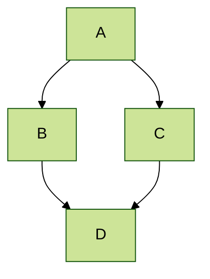

# Broken Graph
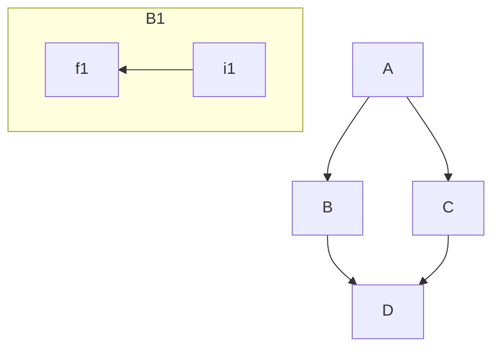

# Working flow chart

# More complex subgraph
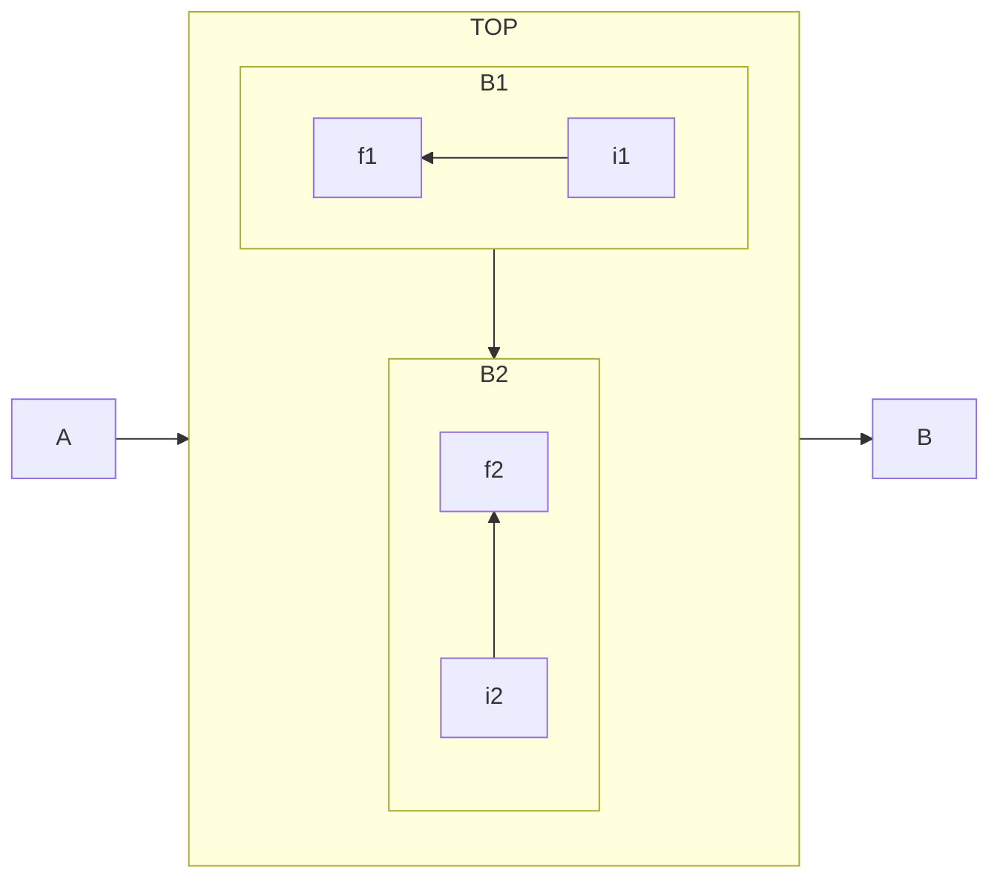

# Node Links
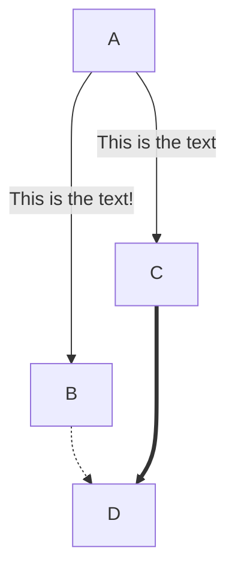
# Node Shapes
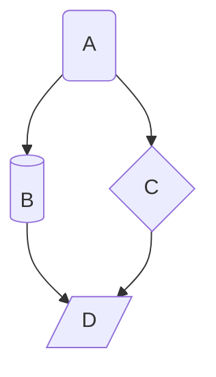
# Links!

# Sequence Diagram
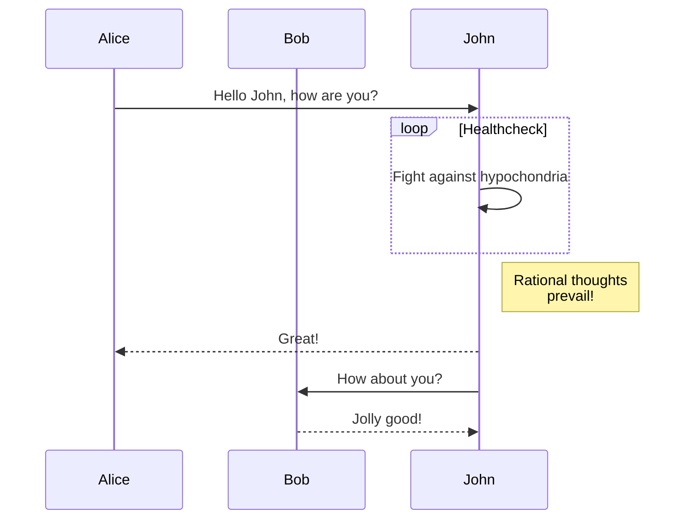

# Gantt 
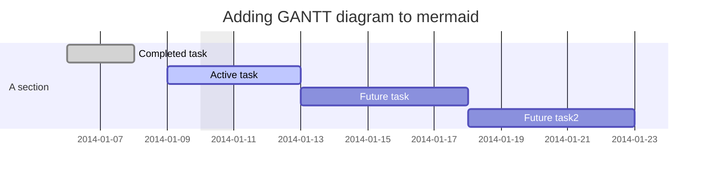

# Class Diagram
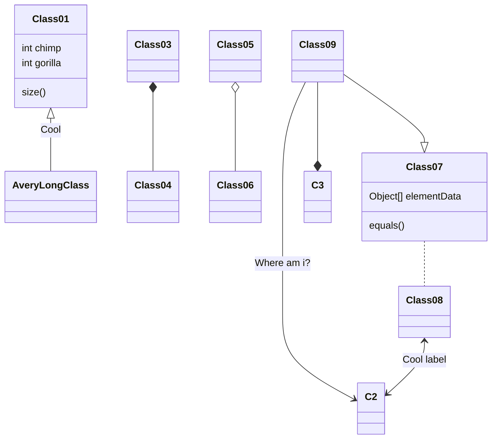

# Git Graph - Experimental
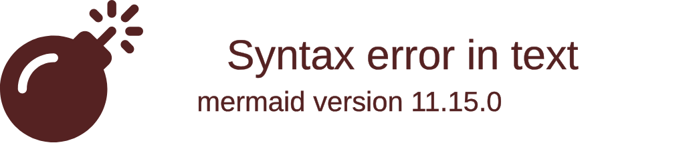

# Entity Relationship Diagram - Experimental
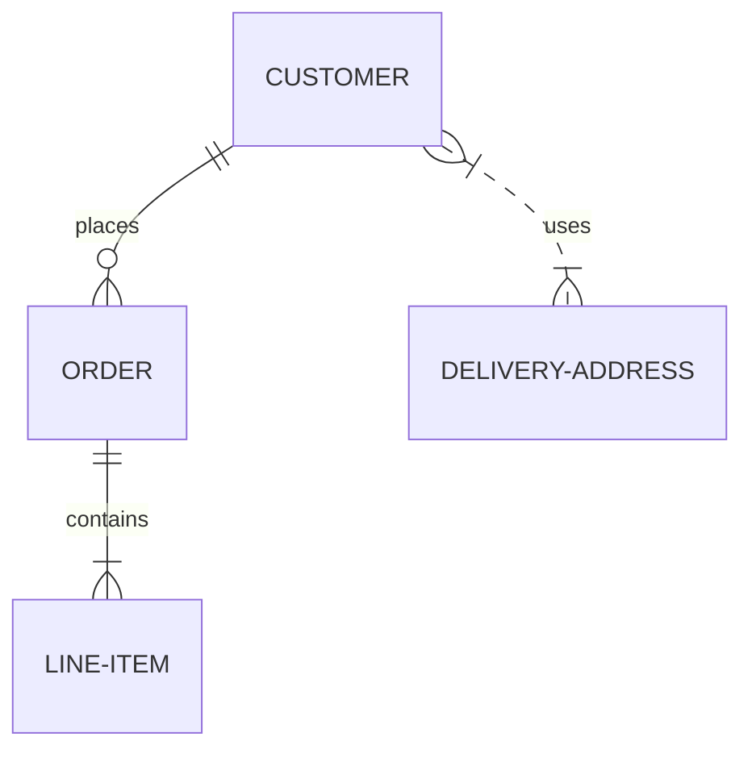

# User Journey Diagram
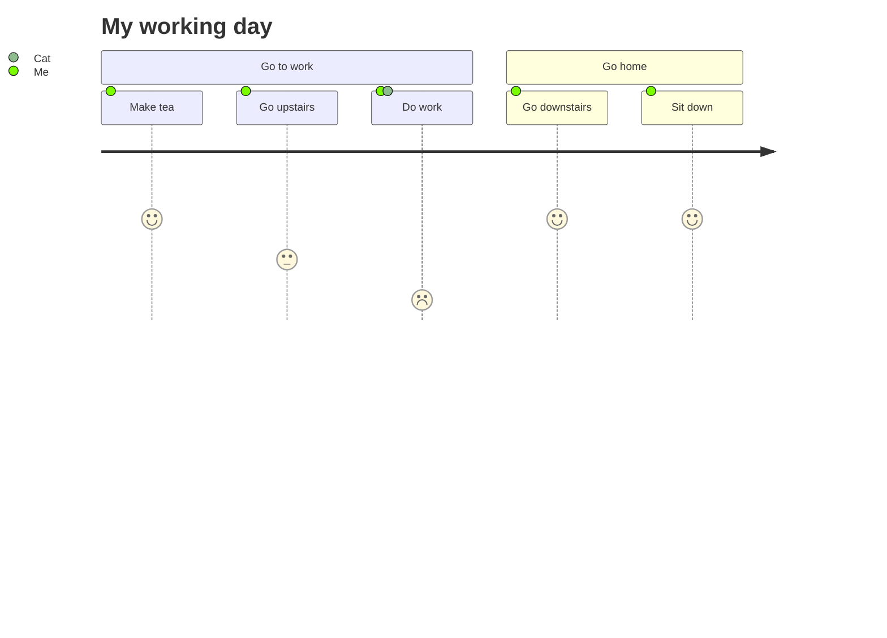